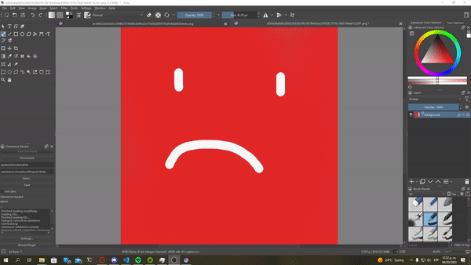

# OmniverseKrita
A simple Omniverse connector for Krita

## Overview
This plugin lets you connect to the Omniverse platform and manage, edit, save, live sync and delete files compatible with the Krita application. 

 

Users can connect to multiple Nucleus servers by creating and adding connections the connection list. This creates a login form in the web browser and connects to the new nucleus host.

Users can now share and collaborate easier with the live sync system that allows to save and edit on the fly textures.

The plugin uses a custom c library from the C++ Omniverse API and loads it as an c_types library. This was made to handle files from the C++ perspective. 

The plugin also contains experimental features that can be activated or disabled per user request.

## Features

* Connection to Omniverse platform
* Live saving and updating files
* Live syncing files
* Loading external nucleus connections

## How to use it
Open the Omniverse launcher and log in to the Nucleus server system. After that Just drop the content of the [omniverse folder](./omniverse/) to the pykrita folder and open Krita.

* Windows: %APPDATA%\krita\pykrita\
* Linux: ~/.local/share/krita/pykrita/
* Apple: ~/Library/Application Support/Krita/pykrita/

When the docker is loaded, click the **Connect** Button and it will sign in to the nucleus server.

* In version 1.0 is necessary for the user to have launched the Omniverse launcher and the Nucleus system

## Changelog
* 04/03/2023 Initial commit version 1.0
  * Users can load, create, save, and live sync files
  * Users can connect to a remote host
  * Connecting to a remote host may take time

## TODO:
* Handle error responses
* Handle quicker connections to remote hosts
* Create Linux and Apple version if possible